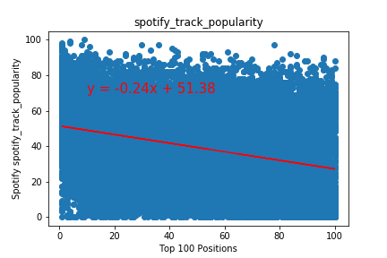
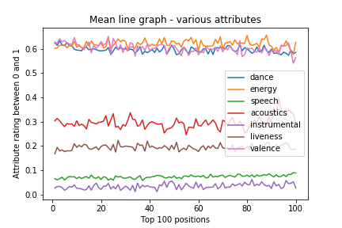
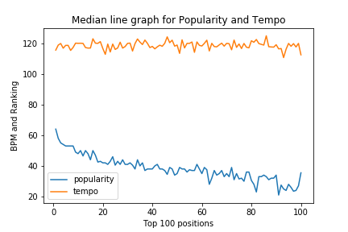

# Spotify Analysis of top100 songs from 1958 to 2018
The first group project for Data Analytics Class

Goal:
Examine the top songs from the Billboard 100 spanning from 1958 to 2019 as well as Spotify data and see if there are characteristics that these songs share. Are these characteristics propelling certain songs to become hits? Through data cleaning and plotting what we find, we hope to find if there are any correlations that support the questions that follow.

Questions:
Overarching Question : What makes a top hit a top hit?
1) Is there a similar attribute (i.e valence/energy/danceability) that a large portion of the songs have?
2) Is there a particular genre that dominates the top hits playlist?
3) Is there a connection between the hits globally and what countries it ‘blows up’ in? (i.e if it ‘blows up’ in the USA, is it more likely to be a hit in the global playlist)

The main files are music and CountryComparison to cover the work done.  The final presentation is uploaded along with all the graphs 
that we created.

The powerpoint presentation provides a view of what was done.

